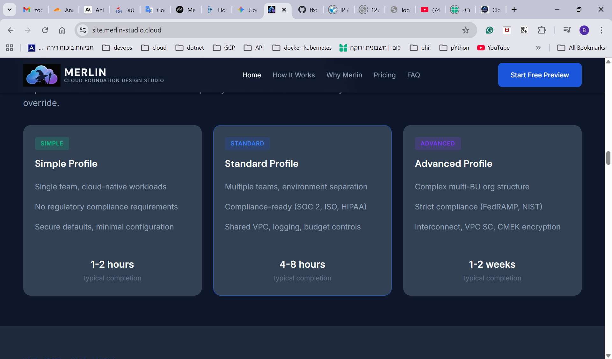
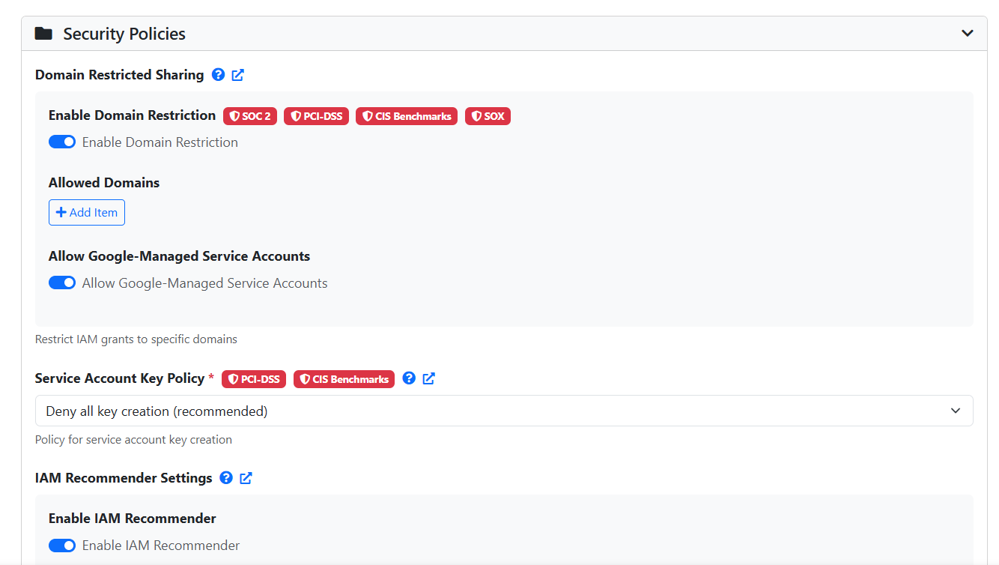

# GCP Landing Zones in 2026: There's a Better Way

You've been there. Weeks designing a landing zone. Months fixing it. Let's talk about why that keeps happening — and what we built to stop it.

---

## The Real Problem

Landing zone decisions don't live in isolation. A networking choice affects your security posture. Your security posture drives compliance. Compliance shapes encryption and audit logging. When those decisions get made across spreadsheets, Slack threads, and tribal knowledge — without a process connecting them — you get gaps nobody notices until they're deployed.

The most common ones we see:

- **CMEK wired wrong** — keys created, service agent bindings never set. Encryption declared, not enforced.
- **GKE secondary ranges missing** — subnet deploys fine, cluster fails at runtime.
- **DATA_READ audit logging off** — SOC 2 gap discovered in the audit, not the design.
- **Budget alerts silent** — currency code missing. You find out from the invoice.

These aren't skill problems. They're what happens without a structured design process.

---

## Before and After

| Without Merlin | With Merlin |
|---|---|
| Weeks editing YAML and HCL, tracing module dependencies, hoping nothing breaks downstream | Guided wizard across 16 domains — Express for defaults, Guided for explanations, Expert for full control |
| One-size-fits-all enterprise template regardless of your actual org size | Discovery-driven profile — Simple, Standard, or Advanced — calibrated to your actual context |
| Compliance mapped in spreadsheets, verified in audits | 370+ field-level compliance upgrades applied automatically, every setting traceable to its regulatory source |
| Security gaps found after deployment — or after a breach | Six validation layers before you deploy, every failure explained with a fix |

---

## How It Works

### Phase 1 — Discovery (15–30 min)

Answer structured questions across 7 categories: business profile, identity & billing, technical context, compliance requirements, infrastructure, workloads, and preferences. No blank page. Every question includes context so stakeholders can contribute without deep GCP expertise.

When done, Merlin recommends your profile — Simple, Standard, or Advanced — based on your answers.

### Phase 2 — Configuration (1 hour to 2 days)

This is where the real work happens — and where Merlin earns its place.

You configure up to 16 technical domains. For each setting, Merlin shows you the recommendation, explains why, and tags which compliance frameworks require it. Every toggle, every dropdown — in context.

*Every setting tagged to its compliance framework. "Deny all key creation" marked PCI-DSS and CIS Benchmarks. Domain restriction tagged SOC 2, PCI-DSS, SOX. No guessing what's required.*

Three modes let you control depth per domain:
- **Express** — one click, smart defaults. ~30% of guided time.
- **Guided** — see each recommendation with reasoning. Right for most production deployments.
- **Expert** — every field exposed, Terraform variable names visible. For architects who need full control.

Switch modes freely. Save at any point. Every change is versioned.

Compliance is wired in here — not bolted on later. Select FedRAMP and Merlin enforces CMEK, VPC Service Controls, audit log retention, and locked org policies. Select HIPAA and PHI access controls and encryption requirements apply automatically. Eleven frameworks supported.

### Phase 3 — Generate (seconds)

One click. Complete output package — FAST YAML datasets for all Google Cloud Foundation Fabric stages, or classic Terraform `.tfvars`. Architecture diagrams. Full README. CMEK wiring guide with post-deployment `gcloud` commands. And a scorecard.

*26+ weighted checks across IP planning, GKE, IAM, encryption, multi-region, and logging. Every failure explained — not just flagged.*

Requirements change? Update your inputs, regenerate. Terraform, docs, diagrams, and scorecards stay in sync. Every version saved.

---

- **Healthcare** → [GCP Landing Zone for a healthcare organization](https://github.com/Merlin-Studio/Healthcare-Example)
- **Government** → [GCP Landing Zone for US Federal Agency](https://github.com/Merlin-Studio/US-Federal-Agency-Example)
- **Startups** → [Fast to production] (https://github.com/Merlin-Studio/Startup-Example)
---

## Try It Free

Two weeks, no credit card. See what your landing zone should look like before you write a line of Terraform.

→ **[free access](https://app.merlin-studio.cloud/**

---

© 2026 Merlin Studio. Licensed under [CC BY-ND 4.0](https://creativecommons.org/licenses/by-nd/4.0/).
