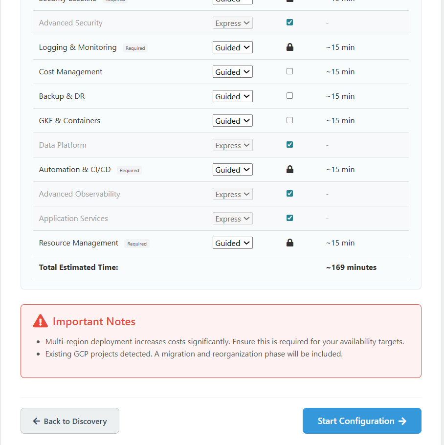
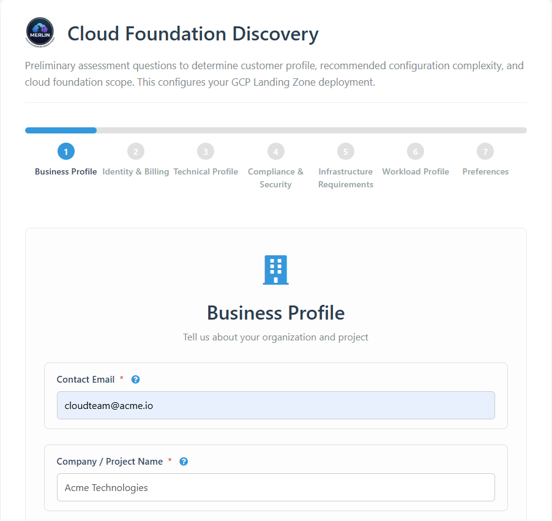
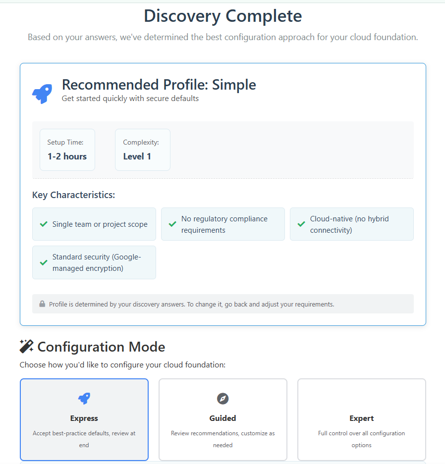
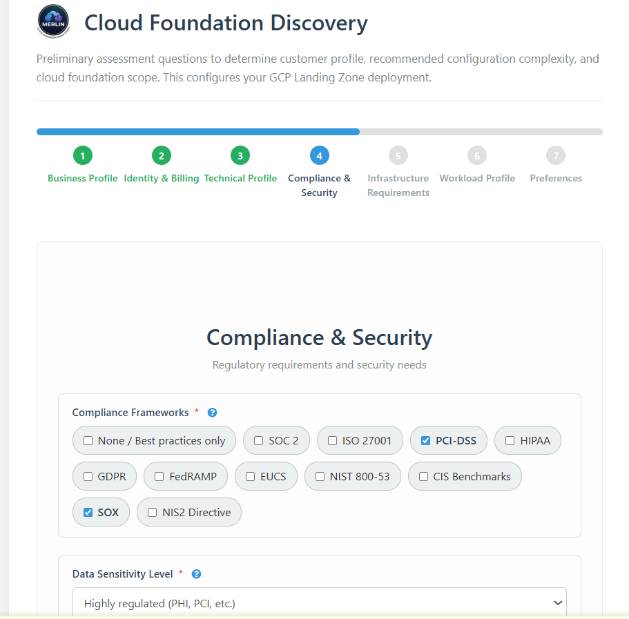
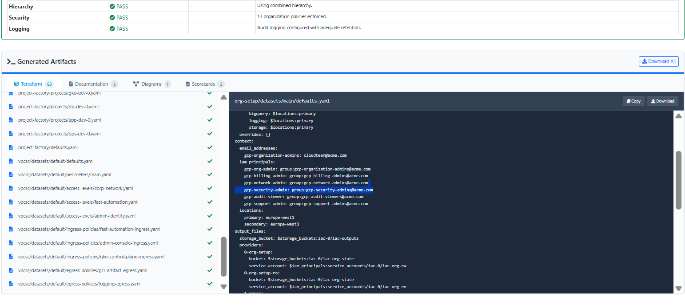
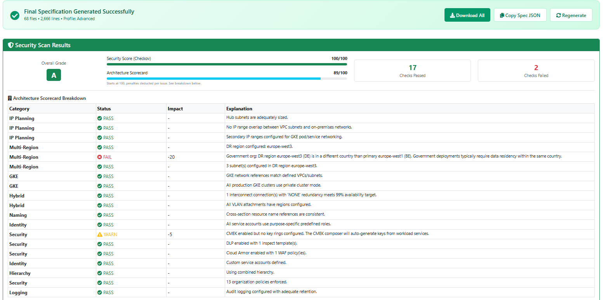
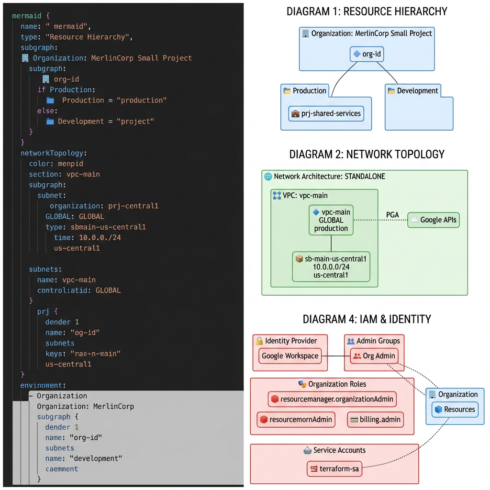

# GCP Landing Zones in 2026: There's a Better Way

> I've watched too many good teams spend weeks designing a landing zone, only to spend months fixing it. This is about why that keeps happening — and what we built to stop it.

---

## I Know This Pain

If you've designed a GCP landing zone before, you know how it goes.

You start with a blank page — or worse, a template from a consultancy that was built for a different company. You make decisions about folder structure, networking, IAM, security policies. Each one seems reasonable in isolation. Then six months later, someone discovers that the networking choice you made conflicts with a compliance requirement that nobody mentioned at the start. Or the CMEK configuration looks right but was never actually wired to anything. Or the budget alerts were never firing because the currency code was missing.

This isn't a skill problem. These are **structural problems** — the kind that happen when decisions are made across 16 interconnected domains without a process that connects them.

I've seen this at startups, at enterprises, at consulting firms with experienced architects. The tools available until now didn't actually solve it — they just gave you more Terraform to write.

That's why we built [Merlin Studio](https://site.merlin-studio.cloud).

*Three phases: structured discovery to understand your context, guided configuration across all 16 technical domains, and one-click generation of production-ready FAST output.*

---

## What Actually Goes Wrong

The core problem with landing zone design isn't complexity — it's **interconnection**.

A decision in networking affects your security posture. Your security posture drives compliance readiness. Your compliance configuration shapes what your cost controls can do. When these decisions are made separately — in different documents, by different people, at different times — the result is inconsistencies that nobody notices until they're already deployed.

The domains that cause the most problems in practice:

**Networking** — subnet sizing decisions made at design time cannot be changed without recreating subnets. GKE secondary ranges (pod and service CIDRs) are the most commonly missed element. The cluster fails to come up with a networking error that takes real time to trace back to a design gap.

**Encryption** — CMEK requires not just key ring and key creation, but explicit service agent bindings via `gcloud` commands after project creation. The key configuration without the bindings produces a landing zone where encryption is declared but not actually wired. We've seen this in real production environments.

**Audit logging** — Admin Activity logs are always on. Data Access logs for `DATA_READ` require explicit enablement. Missing this is a SOC 2 gap that auditors will find. Better to find it at design time.

**Billing** — budget alerts configured without a currency code never fire. You only discover this when the invoice arrives.

**Compliance** — selecting a compliance framework after the design is done isn't configuration, it's redesign. FedRAMP, HIPAA, and PCI-DSS controls affect resource hierarchy, networking topology, encryption configuration, and audit logging simultaneously. You can't bolt them on.

These aren't exotic edge cases. They come up in almost every landing zone we've reviewed.

---

## The Right Profile Makes Everything Easier

The single most important decision in a landing zone design is choosing the right complexity profile. Get this wrong and you're either over-engineering a startup or under-engineering a regulated enterprise.

*After discovery, Merlin recommends a profile with full reasoning. Standard here: multiple teams, compliance-ready, optional hybrid connectivity. You can override at any time.*

**Simple** is for a single team with cloud-native workloads and no regulatory requirements. Two folders, basic standalone networking, secure defaults. You're up and running in 1–2 hours. Don't add complexity you don't need.

**Standard** is for multiple teams or environments, compliance requirements (SOC 2, ISO, PCI, HIPAA), hub-and-spoke networking, and optional hybrid connectivity. Most production deployments sit here. Plan for 4–8 hours of configuration.

**Advanced** is for complex multi-BU structures, strict compliance (FedRAMP, NIST 800-53, GDPR), multi-region connectivity, VPC Service Controls, CMEK encryption, and policy-as-code. This takes 1–2 weeks — and it should, because the decisions are genuinely complex.

Five things push you up a tier regardless of your initial instinct: a compliance requirement exists, multiple teams need environment separation, hybrid connectivity is required, data is sensitive (PHI, PCI, government), or multi-region DR is needed. If any of these apply, don't try to squeeze into a simpler profile.

---

## Start With Discovery, Not Configuration

Before any configuration begins, there are seven categories of questions that every downstream decision depends on. Most teams skip this or rush it. That's where the problems start.

*Structured discovery across 7 categories — each question includes context so stakeholders can contribute without deep GCP expertise. No blank-page requirements gathering.*

The seven categories:

**Business Profile** — org size, project scope, team structure. Determines folder depth and naming conventions.

**Identity & Billing** — authentication providers, directory sync, billing structure, cost allocation. Determines IAM design and Workforce Identity Federation requirements.

**Technical Profile** — existing GCP infrastructure, migration context, operational maturity. Determines whether a migration phase is needed.

**Compliance & Security** — which frameworks apply (FedRAMP, HIPAA, SOX, PCI-DSS, GDPR, NIST 800-53), data residency requirements, security baseline. Determines which org policies are mandatory and what compliance controls get applied.

**Infrastructure Requirements** — primary and DR regions, connectivity type (public-only, VPN, Partner Interconnect, Dedicated Interconnect), compute preferences. Determines VPC topology.

**Workload Profile** — application types, traffic patterns, scaling requirements, storage needs. Determines subnet sizing and GKE secondary ranges.

**Preferences** — naming conventions, tagging taxonomy, configuration mode. Determines consistency across all generated artifacts.

Rushing discovery is the root cause of the inconsistencies that lead to costly rework. A decision in compliance without knowing your regional requirements can produce a data residency conflict that requires redesigning both networking and folder hierarchy.

---

## Configuration That Actually Guides You

Once discovery is complete, Merlin walks you through all 16 technical domains. Three modes let you control depth per section — switch freely as needed.

*Express accepts best-practice defaults in one click. Guided shows the recommendation with reasoning. Expert exposes every Terraform variable. You choose per domain.*

Most production deployments use Express for straightforward sections and Guided or Expert where the decisions carry compliance or security weight.

The 16 domains cover the full scope of a GCP landing zone: Resource Hierarchy, IAM & Access, Networking, Security & Guardrails, Logging & Monitoring, Billing & Cost Management, Encryption & Key Management, Compliance Framework, Backup & DR, GKE & Containers, Data Platform, Automation & CI/CD, Advanced Observability, Application Services, Advanced Security, and Resource Management.

Every setting in every domain is cross-referenced. Change something in networking and the tool knows what else is affected.

---

## Compliance Wired In — Not Added Later

This is the part that most tools get wrong.

Compliance isn't a checklist you apply at the end. It's a set of architectural constraints that affect decisions across every domain. Merlin applies compliance framework controls before configuration — so your output is compliant from the start, not patched after.

*Every setting shows which regulatory frameworks require it. Select FedRAMP and Merlin enforces CMEK, specific audit retention, VPC Service Controls, and locked org policies — automatically.*

Select FedRAMP and it enforces CMEK, specific audit log retention, VPC Service Controls, and locked org policies. Select HIPAA and it enforces encryption at rest and in transit, PHI access controls, and audit logging requirements. Select PCI-DSS and it enforces network segmentation and cardholder data environment isolation.

Every setting is traceable to its regulatory source. No spreadsheets. No manual checklists. No discovering gaps in an audit.

---

## What You Get in One Click

When your design is complete, one click generates the full output package.

*63 files covering all FAST stages — org-setup, networking, security, project-factory, VPC-SC, CMEK — with inline preview before download.*

The output includes FAST YAML datasets for all Google Cloud Foundation Fabric stages, or classic Terraform `.tfvars` files if you prefer. Architecture diagrams in Mermaid — resource hierarchy, VPC topology, IAM structure, DR layout. A full README with per-section configuration tables. A CMEK wiring guide with post-deployment `gcloud` commands. And scorecards that tell you exactly where your design stands before you deploy.

*Security scan 100/100. Architecture scorecard 89/100 — every check explained with actionable detail. You know exactly what to fix before a single resource is created.*

The architecture scorecard runs 26+ weighted checks across IP planning, multi-region readiness, GKE configuration, hybrid connectivity, naming, IAM, encryption, org policies, and logging. Every failure is explained — not just flagged.

The diagrams come from your actual design — not generic templates:

*Resource hierarchy, network topology, and IAM identity — generated automatically from your configuration.*

---

## For Every Kind of GCP Project

- **Healthcare, fintech, insurance** → [GCP Landing Zone for Regulated Industries](../gcp-landing-zone-regulated/) — HIPAA, PCI-DSS, SOC 2 in detail
- **Government** → GCP Landing Zone for Government — FedRAMP and NIS2/GDPR for public sector *(coming soon)*
- **Startups** → GCP Cloud for Startups — Simple and Standard profiles, fast to production *(coming soon)*

---

## Try It

Two weeks free. No credit card.

→ **[Request free preview access](https://site.merlin-studio.cloud/#preview-form)**

*Free two-week preview · No credit card required*

---

© 2026 Merlin Studio. Licensed under [CC BY-ND 4.0](https://creativecommons.org/licenses/by-nd/4.0/).
