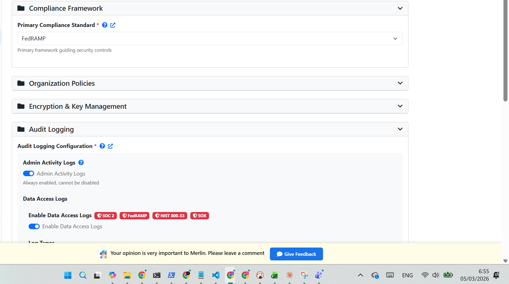

# How to Build a GCP Landing Zone in 2026

> A practical, opinionated guide for cloud architects who need to get it right the first time.

---

## Why Landing Zones Still Fail

Every year, teams deploy a GCP landing zone the same way: fast, with good intentions, and without a structured design process. Six months later, they're paying $50,000–$150,000 to a consultancy to untangle it.

The problem isn't effort. It's that landing zone decisions are deeply interconnected. A choice you make in networking affects your security posture. Your security posture drives your compliance readiness. Your compliance configuration determines what your cost controls can do. Change one thing late, and you're not editing a file — you're redesigning a foundation that production workloads are already sitting on.

What's changed in 2025–2026 that makes this guide different from older ones:

- **Compliance requirements hardened.** FedRAMP enforcement expanded, GDPR fines increased, and HIPAA audits intensified. "We'll add compliance later" is no longer a viable plan.
- **FAST Fabric matured.** Google Cloud Foundation Fabric is now the de facto standard for production GCP foundations — but it still requires a complete, validated design to be useful.
- **AI-assisted design is viable.** Tools like [Merlin Studio](https://site.merlin-studio.cloud) can now compress the structured design phase from weeks to hours, with built-in validation and FAST-ready output.

The thesis of this guide is simple: **a landing zone built without structured design is technical debt from day one.** The rest of this article is about how to avoid that.

*Merlin's three-phase approach: Discover → Design → Generate. The profile you choose determines your entire architecture scope.*

---

## What a Landing Zone Actually Is

A GCP landing zone is not a Terraform file. It's not a folder structure. It's not even a deployment.

A landing zone is the sum of all decisions made across the foundational domains of your GCP organization — before your first application workload is deployed. Those decisions cover at least 16 distinct technical domains:

- **Resource Hierarchy** — folder structure, project naming, environment separation
- **IAM & Access** — roles, groups, service accounts, least-privilege policies
- **Networking** — VPC design, subnets, firewall rules, Private Google Access, hybrid connectivity
- **Security & Guardrails** — Organization Policies, VPC Service Controls, Security Command Center
- **Logging & Monitoring** — log sinks, audit trails, retention, alerting
- **Billing & Cost Management** — budgets, alerts, cost allocation labels, export configuration
- **Encryption & Key Management** — CMEK configuration, service agent bindings, key rings
- **Compliance Framework** — regulatory baseline selection and enforcement
- **Backup & DR** — regional strategy, recovery objectives, cross-region configuration
- **GKE & Containers** — private cluster mode, secondary IP ranges, node pool design
- **Data Platform** — BigQuery datasets, data residency, DLP policy
- **Automation & CI/CD** — service account permissions, Artifact Registry, pipeline access
- **Advanced Observability** — custom dashboards, log-based metrics, alerting policies
- **Application Services** — API Gateway, Cloud Armor, WAF policies
- **Advanced Security** — DLP inspection templates, Binary Authorization, threat detection
- **Resource Management** — label taxonomy, quota configuration, org-level constraints

"Production-ready" doesn't mean deployed. It means validated, documented, consistent across all 16 domains, and reproducible. A landing zone that passes a Checkov scan but has no DR region configured is not production-ready. A landing zone with correct networking but empty security contacts is not production-ready.

The most common misconception is that compliance can be added after deployment. In practice, retrofitting FedRAMP or HIPAA controls onto an existing landing zone requires changes to resource hierarchy, networking topology, encryption configuration, and audit logging simultaneously. It's not an upgrade — it's a redesign.

---

## Choosing Your Profile: The Most Important Decision

Before any configuration, you need to choose the right complexity profile for your organization. This single decision determines the scope of everything that follows.

*After structured discovery, Merlin recommends a profile with confidence score. You can override the recommendation at any time.*

### The Three Profiles

**Simple**
- Single team, cloud-native workloads
- No regulatory compliance requirements
- 2 folders, basic standalone networking
- Typical completion: 1–2 hours

**Standard**
- Multiple teams or environments
- Compliance-ready: SOC 2, ISO, PCI, HIPAA
- Hub-and-spoke VPC, 5 folders, shared services
- Optional hybrid connectivity (VPN or Partner Interconnect)
- Typical completion: 4–8 hours

**Advanced**
- Complex multi-BU org structure
- Strict compliance: FedRAMP, NIST 800-53, GDPR
- 8+ folders, multi-region connectivity, VPC Service Controls, CMEK encryption, policy-as-code
- Typical completion: 1–2 weeks

### What Forces You Up a Tier

Five conditions should push you to a higher profile regardless of your initial instinct:

1. **Compliance requirement exists** — even a single regulated workload (HIPAA, PCI-DSS, FedRAMP) forces Standard or Advanced
2. **Multiple teams or environments** — dev/staging/prod separation with different access controls requires Standard at minimum
3. **Hybrid connectivity** — any VPN or Interconnect requirement moves you out of Simple
4. **Data sensitivity** — PHI, PII, payment data, or government data requires encryption and audit controls that Simple doesn't cover
5. **Multi-region requirement** — DR configurations and data residency constraints belong in Standard or Advanced

The cost of under-engineering is a redesign. The cost of over-engineering is a longer initial build. For most teams, the redesign is the more expensive mistake.

---

## The 7 Discovery Questions You Must Answer First

Before you open Terraform, before you choose a profile, before you draw a VPC diagram — answer these seven questions. They are the inputs that every downstream decision depends on.

*Merlin's structured discovery covers all 7 categories with context for each question, so stakeholders can contribute without deep GCP expertise.*

**1. Business Profile**
Organization size, project scope, team structure, contact information. Determines folder depth and project naming conventions.

**2. Identity & Billing**
Authentication providers (Google Workspace, Azure AD, Okta), directory sync approach, billing account structure, cost allocation strategy. Determines IAM design and Workforce Identity Federation requirements.

**3. Technical Profile**
Existing GCP infrastructure, migration context, operational maturity, current IaC tooling. Determines whether a migration and reorganization phase is needed.

**4. Compliance & Security**
Regulatory frameworks that apply (FedRAMP, HIPAA, SOX, PCI-DSS, GDPR, NIST 800-53), data residency requirements, security baseline expectations. Determines compliance domain configuration and which org policies are mandatory.

**5. Infrastructure Requirements**
Primary and DR regions, connectivity type (public-only, VPN, Partner Interconnect, Dedicated Interconnect), compute environment preferences (GKE, VMs, serverless). Determines VPC topology and hybrid connectivity design.

**6. Workload Profile**
Application types (web, data, batch, containerized), traffic patterns, scaling requirements, storage needs. Determines subnet sizing, GKE secondary ranges, and data platform configuration.

**7. Preferences**
Naming conventions, tagging taxonomy, configuration mode preference (Express / Guided / Expert). Determines consistency across all generated artifacts.

Skipping or rushing discovery is the root cause of the inconsistencies that lead to costly rework. A choice made in section 4 (compliance) without knowing the answer to section 5 (regions) can produce a data residency conflict that requires redesigning both networking and the folder hierarchy.

---

## The 16 Configuration Domains

Once discovery is complete and a profile is selected, configuration covers all 16 technical domains. Three modes let you control depth per section:

- **Express Mode** — accept best-practice defaults with one click; ideal for domains where defaults fit your context
- **Guided Mode** — see the recommended setting with an explanation of why, then accept or adjust
- **Expert Mode** — full access to every option, Terraform variable names visible alongside each setting

*After discovery, you choose your configuration mode. Express is fastest; Expert exposes every Terraform variable. You can switch modes freely per domain.*

You can switch modes freely between domains. Most production deployments use Express for straightforward sections (naming, preferences, application services) and Guided or Expert for the domains that carry compliance or security weight (IAM, networking, security, logging).

*Merlin generates Mermaid architecture diagrams showing resource hierarchy, VPC topology, and IAM structure — automatically, from your configuration.*

The domains that most commonly contain gaps in hand-built landing zones are:

**Resource Hierarchy** — teams underestimate folder depth. A flat structure works until you need to apply different org policies per environment, at which point restructuring is painful.

**IAM & Access** — service account keys are the default failure mode. A well-designed landing zone never creates a service account key; all automation uses Workload Identity Federation or impersonation chains.

**Networking** — subnet sizing decisions made at design time cannot be changed without recreating subnets. GKE secondary ranges (pod and service CIDRs) are the most commonly missed element.

**Security & Guardrails** — Organization Policies are the lowest-cost, highest-impact security control in GCP. A standard production LZ should enforce at minimum: domain restriction, uniform bucket-level access, disabling serial port access, and requiring OS login.

**Logging & Monitoring** — audit logging has three types: Admin Activity (always on), Data Access (off by default), and System Event. Missing `DATA_READ` in Data Access logs is a SOC 2 gap that is regularly discovered post-deployment.

**Encryption & Key Management** — CMEK requires not just key ring and key creation, but explicit service agent bindings via `gcloud` commands after project creation. The key configuration without the bindings produces an LZ where encryption is declared but not wired.

**Compliance Framework** — selecting a compliance framework at design time allows the tool to automatically enforce required controls across all sections before code generation. Selecting FedRAMP, for example, forces CMEK, enforces specific audit retention, requires VPC Service Controls, and locks certain org policies.

*Compliance frameworks wire directly into configuration — each setting shows which regulatory frameworks require it. No spreadsheets, no manual checklists.*

---

## Tooling in 2026: What to Actually Use

### FAST Fabric as the Standard

Google Cloud Foundation Fabric's FAST (Fast, Autonomous, Scalable, Terraform) framework is the production standard for GCP foundations in 2026. It provides battle-tested modules for every stage of a landing zone deployment: org setup, networking, security, project factory, VPC Service Controls, and CMEK.

FAST is not a beginner tool. It requires a complete, validated design as input. Teams that try to use it without structured design end up with partially configured stages, inconsistent variable references, and state management issues that are difficult to debug.

### Two Output Formats

FAST supports two input formats, and understanding the difference matters:

**FAST YAML datasets** — the newer, recommended format. Configuration lives in structured YAML files that FAST modules consume directly. Each stage has its own dataset directory. This format eliminates entire categories of errors: provider configuration, resource syntax, state management. The architect's job shifts from writing Terraform to validating design decisions.

**Classic `.tfvars` files** — the original format. More familiar to teams already using Terraform directly, and useful when you need to customize beyond what FAST modules expose. Requires more manual work but gives full control.

For most production deployments, FAST YAML is the right choice. For complex migrations or highly customized architectures, `.tfvars` gives the flexibility needed.

### What to Avoid

- **Hand-rolled modules** — reinventing FAST from scratch introduces provider version drift, missing org policy coverage, and undocumented state dependencies
- **Outdated blueprints** — Google's older "terraform-example-foundation" and similar repos are not maintained at the same pace as FAST Fabric; check the commit history before using any community blueprint

### Design Tools

The gap between a structured design and FAST-ready output is where most teams lose the most time. Merlin Studio closes that gap: structured discovery produces a validated design, which generates FAST YAML datasets, scorecards, and architecture diagrams in one click.

*63 generated files covering all FAST stages — org-setup, networking, security, project-factory, VPC-SC, CMEK — with inline preview before download.*

---

## Compliance on Day Zero

Six frameworks drive the majority of GCP landing zone compliance requirements in 2026:

- **FedRAMP** — US federal cloud authorization; requires CMEK, VPC Service Controls, specific audit retention, and FIPS-validated endpoints
- **HIPAA** — healthcare PHI protection; requires encryption at rest and in transit, audit logging, access controls, and BAA with Google
- **PCI-DSS** — payment card data; requires network segmentation, cardholder data environment isolation, and quarterly vulnerability scanning
- **SOC 2** — service organization controls; requires audit logging including DATA_READ, access reviews, and change management controls
- **NIST 800-53** — US federal security controls framework; extensive control family coverage including AC, AU, CM, IA, SC, SI
- **GDPR** — EU data protection; requires data residency controls, processing records, and the ability to demonstrate lawful basis for data handling

The critical insight is that compliance controls are not settings you add to an existing landing zone. They are architectural decisions that affect resource hierarchy, networking topology, encryption configuration, and logging from the start. Attempting to retrofit FedRAMP onto a Standard landing zone that wasn't designed with it in mind typically requires changes across 8–10 of the 16 configuration domains simultaneously.

The right approach: select your compliance frameworks during the discovery phase, before any configuration begins. Every setting that follows is then evaluated against the selected frameworks, with non-compliant choices flagged before they become part of your design.

---

## What Good Output Looks Like — and Common Mistakes

A well-designed GCP landing zone generates clean scorecards:

*Security scan 100/100 (Checkov). Architecture scorecard 89/100 — 17 checks passed, 2 flagged. Every check is explained with actionable detail.*

The architecture scorecard shows 26+ weighted checks across IP planning, multi-region readiness, GKE configuration, hybrid connectivity, naming, IAM, encryption, org policies, and logging. A score of 89/100 with two specific, actionable failures is a good result — the failures are known and fixable before deployment.

The failures that show up most commonly in real deployments — and that are hard to find without automated validation:

**Missing GKE secondary ranges.** Subnets provisioned without pod and service CIDRs for GKE. The landing zone deploys successfully; the GKE cluster fails to come up with a networking error that takes significant time to trace back to subnet configuration.

**CMEK without service agent bindings.** Key rings and keys are created, CMEK is configured — but the post-deployment `gcloud projects add-iam-policy-binding` commands that grant CryptoKey permissions to service agents are not run. Result: CMEK is declared but encryption is not actually enforced.

**Budget without currency code.** The billing budget is configured with an amount but no currency. The budget alert never fires. Often discovered when a runaway workload generates an unexpected invoice.

**Audit logging missing DATA_READ.** Admin Activity logs are always on. Data Access logs for DATA_READ require explicit enablement. This is a SOC 2 control gap that auditors will find — better to find it at design time.

**Single interconnect on a 99.99% SLA.** A single Interconnect connection delivers 99.9% availability. Reaching 99.99% requires redundant connections. If your design specifies 99.99% but configures a single connection, the SLA is mathematically unachievable.

**DR region in a different jurisdiction.** For government workloads, a primary region in one country and a DR region in another violates data residency requirements. The architecture scorecard will flag this (as shown in the screenshot above: "Government org: DR region europe-west3 (DE) is in a different country than primary europe-west1 (BE)").

---

## What Comes Next

This guide covers the complete foundation. The specific implementation paths for regulated environments go deeper:

- **Healthcare & Fintech** → [GCP Landing Zone for Regulated Industries](../gcp-landing-zone-regulated/) — HIPAA, PCI-DSS, and SOC 2 in detail
- **Government** → GCP Landing Zone for Government — FedRAMP and NIS2/GDPR for public sector *(coming soon)*
- **Startups** → GCP Cloud for Startups — Simple and Standard profiles, fast to production *(coming soon)*

---

## Ready to Build Yours?

Merlin Studio guides you through structured discovery, configuration across all 16 domains, and generates production-ready FAST YAML output — with security scorecard and architecture validation included.

→ **[Request free preview access](https://site.merlin-studio.cloud/#preview-form)**

*Free two-week preview · No credit card required*

---

© 2026 Merlin Studio. Licensed under [CC BY-ND 4.0](https://creativecommons.org/licenses/by-nd/4.0/).
